# Assignment 1: Divide-and-Conquer Algorithm Analysis

## A. Project Overview

### Purpose

This project implements four classic divide-and-conquer algorithms in Java, analyses their running-time recurrences (Master Theorem and Akra-Bazzi intuition), measures them on inputs of different sizes and structures, and compares the measurements with the theory.

### Implemented algorithms

| Algorithm | Class | Main ideas | Time | Extra space |
|---|---|---|---|---|
| MergeSort | MergeSorter | linear merge, one reusable buffer, insertion-sort cutoff (16) | Θ(n log n) | Θ(n) |
| QuickSort | QuickSorter | random pivot, in-place 3-way partition, recurse into the smaller part, loop over the larger | Θ(n log n) expected, O(n²) worst case | O(log n) stack |
| Deterministic Select | DeterministicSelector | groups of 5, median-of-medians pivot, in-place partition, continue only in the needed part | Θ(n) worst case | O(log n) stack |
| Closest Pair | ClosestPairSolver | sort by x, recursive halves, merge by y, strip check | Θ(n log n) | Θ(n) |

### Project structure

- src: Metrics.java, MergeSorter.java, QuickSorter.java, DeterministicSelector.java, Point.java, ClosestPairSolver.java, Experiment.java, Main.java
- tests: MergeSorterTest.java, QuickSorterTest.java, DeterministicSelectorTest.java, ClosestPairSolverTest.java
- docs/screenshots: screenshots of the program output, the tests, the results file and the tables
- docs/plots: the charts (time vs n, recursion depth vs n, input type effect)
- results/results.csv: all measurements
- README.md, pom.xml, .gitignore

### How to run

Requirements: JDK 25, Maven.

```bash
mvn test                        # run all correctness tests
mvn compile
java -cp target/classes Main    # run all experiments (1-3 minutes), writes results/results.csv
```

### Metrics

The Metrics class is passed to every algorithm and records the number of comparisons, swaps, recursive calls and the maximum recursion depth (enter() / exit() counters around every recursive call).

### Tests

- MergeSort and QuickSort are compared with Arrays.sort() on random, sorted, reverse-sorted, duplicate-heavy, empty and single-element arrays. QuickSort is also checked for a small recursion depth on 100,000 elements.
- Deterministic Select is checked on 200 random tests against sorted[k], plus all-equal, tiny, sorted, reverse and invalid-index cases.
- Closest Pair is compared with an O(n²) brute-force solution on many small random sets (integer coordinates, so duplicates and equal x values occur), on 2,000 random points, and on duplicate-point and two-point cases.

## B. Algorithm Analysis

### B.1 MergeSort

**How it works.** The array is split in half, both halves are sorted recursively, and the halves are merged in linear time. The merge copies the range into one auxiliary buffer (allocated once and reused by every call) and writes the merged result back into the array. Sub-arrays of at most 16 elements are sorted by insertion sort, which only changes the constant factor. The sort is stable.

**Complexity.** Time Θ(n log n) for every input (already sorted inputs just need fewer comparisons). Space Θ(n) for the buffer plus O(log n) for the recursion stack.

**Recurrence.** T(n) = 2T(n/2) + Θ(n).
Master Theorem: a = 2, b = 2, f(n) = Θ(n) = Θ(n^(log_b a)) = Θ(n¹), so case 2 applies and T(n) = Θ(n log n).

### B.2 QuickSort

**How it works.** A random element is chosen as the pivot and the range is partitioned in place into three parts: less than, equal to, and greater than the pivot (3-way partition). The algorithm recurses only into the smaller of the two outer parts and continues with a loop over the larger one.

**Complexity.** Expected time Θ(n log n). The worst case is O(n²) (the pivot is always the minimum or maximum), but with a random pivot this is extremely unlikely. Because the recursive call always gets at most half of the elements, the stack depth is at most log₂ n, so the extra space is O(log n). With only k distinct keys the 3-way partition gives O(n log k).

**Recurrence.** Balanced case: T(n) = 2T(n/2) + Θ(n), which is case 2 of the Master Theorem and gives Θ(n log n). In general T(n) = T(k) + T(n - k - 1) + Θ(n) with a random k, which solves to Θ(n log n) in expectation. Worst case: T(n) = T(n - 1) + Θ(n) = Θ(n²) (an arithmetic series; the Master Theorem does not cover it).

### B.3 Deterministic Select (Median-of-Medians)

**How it works.**
1. Split the range into groups of 5, sort each group with insertion sort and move its median to the front of the range.
2. Find the median of these medians recursively; it is the pivot.
3. Partition the range in place around the pivot (3-way).
4. Continue only in the part that contains the k-th position (implemented as a loop); if k falls in the "equal" block the pivot is the answer.

**Complexity.** Worst-case time Θ(n). Extra space O(log n) for the recursion (the algorithm works in place).

**Recurrence.** T(n) ≤ T(⌈n/5⌉) + T(7n/10 + 6) + Θ(n).
The Master Theorem does not apply because the two subproblems have different sizes, so we use Akra–Bazzi intuition: find p such that (1/5)^p + (7/10)^p = 1. Since 1/5 + 7/10 = 9/10 < 1, we get p < 1. With g(n) = n, T(n) = Θ(n^p (1 + ∫ u / u^(p+1) du)) = Θ(n^p · n^(1-p)) = Θ(n).

### B.4 Closest Pair of Points

**How it works.** Points are sorted by x once. The recursive procedure splits the x-sorted range in the middle, remembers the x-coordinate of the dividing line, solves both halves (each half comes back sorted by y) and merges them by y. Then it builds the strip of points whose x-distance to the dividing line is smaller than the best distance found so far, and compares each strip point only with the previous strip points whose y-difference is smaller than the best distance. Ranges of at most 3 points are solved by brute force.

**Complexity.** Θ(n log n) time (including the initial sort by x). Space Θ(n) for the copy of the points and the merge buffer, plus O(log n) recursion stack.

**Recurrence.** T(n) = 2T(n/2) + Θ(n) (the y-merge and the strip scan are linear, because a packing argument shows that every strip point is compared with a constant number of neighbours, at most 7). Master Theorem case 2 gives Θ(n log n). If the strip were re-sorted by y at every level, the recurrence would become 2T(n/2) + Θ(n log n) = Θ(n log² n); merging by y inside the recursion avoids this.

### Complexity summary

| Algorithm | Recurrence | Master / Akra–Bazzi result | Time | Space |
|---|---|---|---|---|
| MergeSort | 2T(n/2) + Θ(n) | Master, case 2 | Θ(n log n) | Θ(n) |
| QuickSort | 2T(n/2) + Θ(n) (expected) | Master, case 2 | Θ(n log n) expected, O(n²) worst | O(log n) |
| Deterministic Select | T(n/5) + T(7n/10) + Θ(n) | Akra–Bazzi, p < 1 | Θ(n) | O(log n) |
| Closest Pair | 2T(n/2) + Θ(n) | Master, case 2 | Θ(n log n) | Θ(n) |

## C. Experimental Results

Interactive tables and charts (Google Sheets): [open the spreadsheet](https://docs.google.com/spreadsheets/d/116WmGyucDnAD5AO0cbzj6n29luOEdV_6BRsV2bBWjLs/edit?usp=sharing)

### Setup

- Java 25, Maven, JUnit 5, Windows.
- Input sizes: 1,000; 5,000; 10,000; 50,000; 100,000; 500,000; 1,000,000. Closest Pair was run up to 100,000 points only.
- Input types: random, sorted, reverse (reverse-sorted), duplicates (only 10 distinct values). For Closest Pair, sorted and reverse apply to the x-coordinate, and duplicates means both coordinates come from 10 distinct values.
- Deterministic Select looks for the median (k = n/2).
- Time is measured with System.nanoTime(). Every configuration runs 3 warm-up runs (not recorded) and then 5 measured runs; the table shows the **median**. For the sorting algorithms and Select the copy of the input is made outside the timed region. Test data uses a fixed random seed (42).
- Metrics: time (ms), maximum recursion depth, number of comparisons. All raw data is in results/results.csv (columns: algorithm,inputType,n,timeMs,maxDepth,comparisons).

### Execution time, random input (ms)

| n | MergeSort | QuickSort | Select | Closest Pair |
|---:|---:|---:|---:|---:|
| 1,000 | 0.189 | 0.268 | 0.224 | 0.936 |
| 5,000 | 0.755 | 1.545 | 0.391 | 3.781 |
| 10,000 | 0.980 | 1.208 | 2.727 | 7.031 |
| 50,000 | 5.359 | 6.902 | 4.546 | 45.482 |
| 100,000 | 11.966 | 14.633 | 5.336 | 63.226 |
| 500,000 | 75.950 | 79.901 | 27.700 | n/a |
| 1,000,000 | 152.264 | 166.767 | 54.110 | n/a |

### Maximum recursion depth, random input

| n | MergeSort | QuickSort | Select | Closest Pair |
|---:|---:|---:|---:|---:|
| 1,000 | 7 | 7 | 5 | 10 |
| 5,000 | 10 | 9 | 6 | 12 |
| 10,000 | 11 | 9 | 6 | 13 |
| 50,000 | 13 | 11 | 7 | 16 |
| 100,000 | 14 | 12 | 8 | 17 |
| 500,000 | 16 | 13 | 9 | n/a |
| 1,000,000 | 17 | 14 | 9 | n/a |

### Comparisons, random input

| n | MergeSort | QuickSort | Select | Closest Pair |
|---:|---:|---:|---:|---:|
| 1,000 | 10,473 | 13,140 | 7,616 | 8,719 |
| 5,000 | 58,501 | 74,363 | 40,157 | 55,465 |
| 10,000 | 126,865 | 157,854 | 81,322 | 121,092 |
| 50,000 | 768,819 | 943,986 | 424,629 | 723,163 |
| 100,000 | 1,638,784 | 2,125,353 | 849,899 | 1,546,828 |
| 500,000 | 9,609,609 | 11,602,780 | 4,294,256 | n/a |
| 1,000,000 | 20,224,993 | 24,603,283 | 8,389,672 | n/a |

### Results for different input types, n = 100,000

Time (ms):

| Input type | MergeSort | QuickSort | Select | Closest Pair |
|---|---:|---:|---:|---:|
| random | 11.966 | 14.633 | 5.336 | 63.226 |
| sorted | 3.045 | 8.996 | 2.808 | 30.272 |
| reverse | 5.919 | 9.458 | 2.856 | 32.633 |
| duplicates | 6.752 | 2.412 | 2.203 | 45.322 |

Maximum recursion depth:

| Input type | MergeSort | QuickSort | Select | Closest Pair |
|---|---:|---:|---:|---:|
| random | 14 | 12 | 8 | 17 |
| sorted | 14 | 12 | 8 | 17 |
| reverse | 14 | 11 | 8 | 17 |
| duplicates | 14 | 3 | 8 | 17 |

### Results for different input types, n = 1,000,000 (time in ms)

| Input type | MergeSort | QuickSort | Select |
|---|---:|---:|---:|
| random | 152.264 | 166.767 | 54.110 |
| sorted | 39.768 | 106.343 | 28.705 |
| reverse | 47.025 | 108.469 | 28.782 |
| duplicates | 77.830 | 22.695 | 23.247 |

### Plots

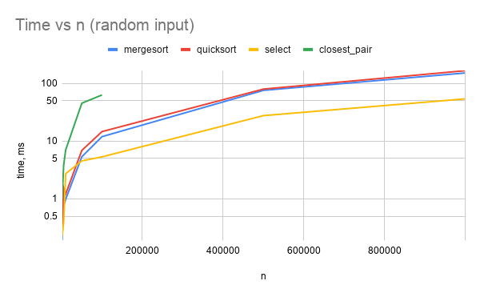

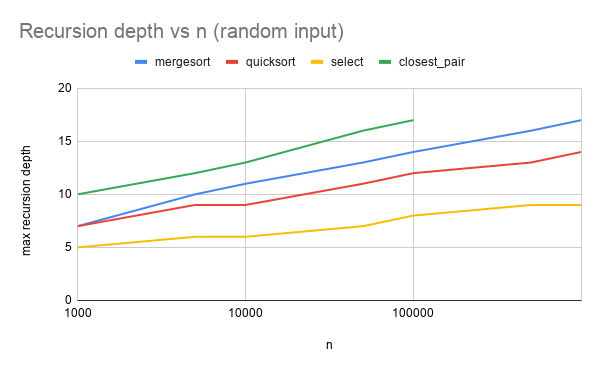

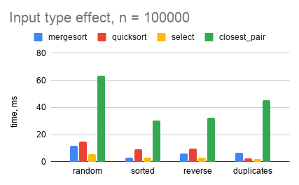

Both axes of the time plot are logarithmic, so a growth like n log n or n appears as an almost straight line. The x-axis of the depth plot is logarithmic, so a straight line means that the depth grows like log n.

## D. Discussion

**Do the results match the theoretical complexity?**
Yes. When n grows 10× (100,000 -> 1,000,000) the time of MergeSort grows 12.7× and that of QuickSort 11.4×, close to the 12.0× predicted for n log n, while Select grows 10.1×, matching the linear 10×. For Closest Pair (10,000 -> 100,000) the time grows 9.0× instead of the predicted 12.5×, but its comparison counts follow n log n very closely. The comparison counts are even cleaner than the times: MergeSort makes about 1.0 · n log₂ n comparisons, QuickSort about 1.25 · n log₂ n, Closest Pair about 0.93 · n log₂ n, and Select about 7.6-8.6 · n for every size. The recursion depth grows by about 1 when n doubles, which is logarithmic behaviour. The measurements for small n are noisy (for example Select at n = 10,000 takes 2.7 ms, more than at n = 5,000 with 0.39 ms and comparable to n = 50,000 with 4.5 ms), which is a JIT/GC effect discussed below.

**How does the input structure affect performance?**
MergeSort always has the same depth (14 at n = 100,000) but is fastest on sorted data (3.0 ms vs 12.0 ms for random) because the merge step needs far fewer comparisons (744,016 vs 1,638,784). QuickSort with a random pivot does not degrade on sorted or reverse input: the comparison counts are almost equal to the random case (2.10 M vs 2.13 M), and it is even faster in time (9.0 ms vs 14.6 ms), most likely because the branches and memory accesses of the partition loop are more predictable on ordered data. On duplicate-heavy data the 3-way partition makes QuickSort the fastest sorter (2.4 ms) with a recursion depth of only 3, since there are just 10 distinct values. Select is only mildly affected (2.2-5.3 ms), and Closest Pair is slowest on random points (63 ms) and faster on sorted/reverse x-coordinates (30–33 ms), even though the comparison counts are almost the same; the initial sort of the points is probably cheaper on ordered data.

**Why does smaller-first recursion help QuickSort?**
The recursive call always receives the smaller part, which has at most n/2 elements, and the larger part is processed by the loop of the same call. Therefore the stack depth is at most log₂ n even when the pivots are bad, whereas naive recursion on both parts can reach depth n and cause a stack overflow. The running time is unchanged; what improves is the guaranteed space: O(log n). In the experiments the depth at n = 1,000,000 is only 14 (the bound is ⌊log₂ 10⁶⌋ = 19).

**Why does Median-of-Medians guarantee O(n)?**
The pivot is the median of the medians of the groups of 5. At least half of the group medians are ≥ the pivot, and each of these groups contributes at least 3 elements ≥ the pivot, so at least about 3n/10 elements are ≥ the pivot (and symmetrically ≤). Hence the recursive call on one side gets at most 7n/10 elements. The algorithm does T(n) ≤ T(n/5) + T(7n/10) + cn. Because 1/5 + 7/10 = 9/10 < 1, the work shrinks geometrically: the total is at most cn(1 + 9/10 + (9/10)² + …) = 10cn. Equivalently, if T(k) ≤ ak for k < n, then T(n) ≤ (9/10)an + cn ≤ an for a ≥ 10c. In our data the number of comparisons stays between 7.6 · n and 8.6 · n for all sizes from 1,000 to 1,000,000.

**Why is divide-and-conquer Closest Pair faster than O(n²) for large inputs?**
Brute force checks n(n - 1)/2 pairs, which is about 5 · 10⁹ distance computations for n = 100,000. The divide-and-conquer version does only Θ(n) work per level over log n levels: after the recursion the only possible closer pairs cross the dividing line, they lie in a strip, and a packing argument shows that each point in the strip has to be compared with at most a constant number of neighbours (sorted by y). Our implementation needed 1.55 · 10⁶ comparisons for n = 100,000, about 3,000 times fewer than brute force, and its time grows as n log n instead of n².

**What practical factors affect performance (JVM, cache, GC, etc.)?**
- *JIT compilation and warm-up.* The JVM first interprets the code and compiles hot methods later, so early runs are slower. We use 3 warm-up runs and the median of 5 measurements, but some outliers remain at small sizes (Select at n = 10,000, QuickSort at n = 5,000).
- *Garbage collection and allocation.* MergeSort allocates its buffer, Closest Pair allocates a copy of the points and a buffer of Point objects. GC pauses can fall into a measured run and inflate it.
- *Memory layout and cache.* Closest Pair and MergeSort need almost the same number of comparisons at n = 100,000 (1.55 M vs 1.64 M), but Closest Pair takes about 5× longer (63 ms vs 12 ms). Arrays of int are contiguous in memory, while an array of Point objects consists of references, which causes more cache misses.
- *Branch prediction.* Sorted or reverse-sorted inputs make the branches in partitioning and merging predictable, which explains why QuickSort and MergeSort are faster on them even when comparison counts are similar.
- *Constant factors and the machine.* Insertion-sort cutoffs, the Select constant (≈8n comparisons for a Θ(n) algorithm), background processes and the power mode of the laptop all influence the absolute times. The results come from a single machine, so only the trends and ratios are meaningful.

## E. Reflection

During this assignment I've learned really a lot of things about analysing algorithms, their types (Deterministic select and Closest Pair of points were new for me). Also I read about new time complexities and how to solve tasks with them. And the main thing that I realized, that I needed to start doing it earlier and check all steps clearly before completing task.(I lost some of my commits in the first repository and had to start again in a new one)
I learned that to get a fair time, I should do warm-up runs and use the median of several runs instead of just one run.

I was surprised that QuickSort works very fast with many duplicate elements because of the 3-way partition. The recursion depth was also quite small, only 14 for one million elements.
I also learned to make a commit after finishing each part, so the Git history shows my actual progress.
One of the hard things was for me to load Maven and JUnit, because my laptop did not work well and just did not accept them, so I spent about 1 day just to set up IntelliJ IDEA. But of course it is not the only hard thing, also understanding and being able to apply Closest pair of points was also not easy, but I figured it all and managed to handle it.

## F. Screenshots

### Program output

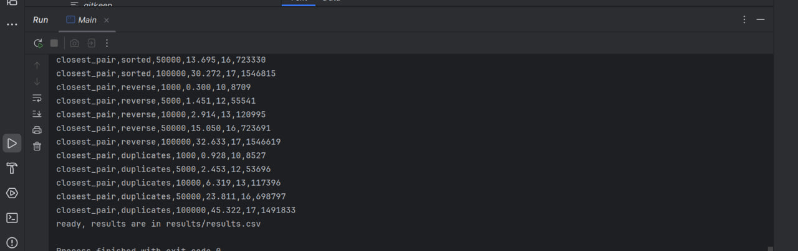

### Test results

MergeSort tests:

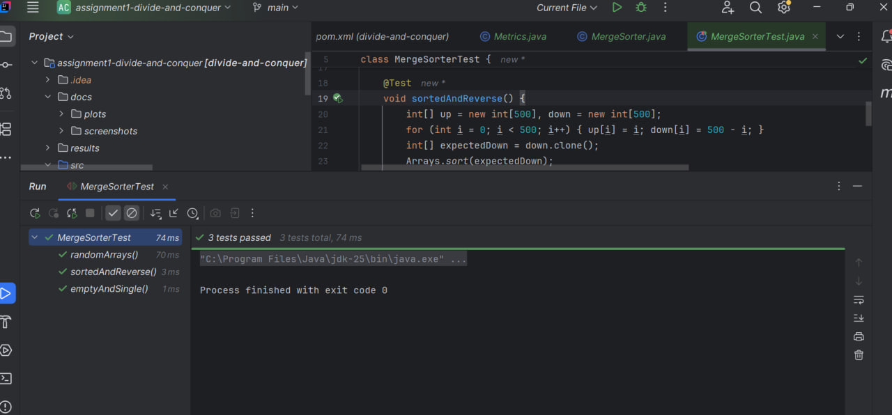

QuickSort tests:

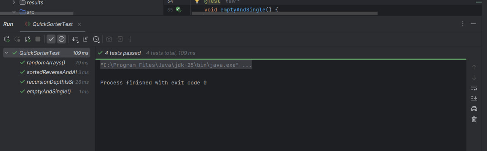

Deterministic Select tests:

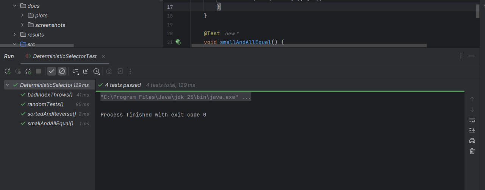

Closest Pair tests:

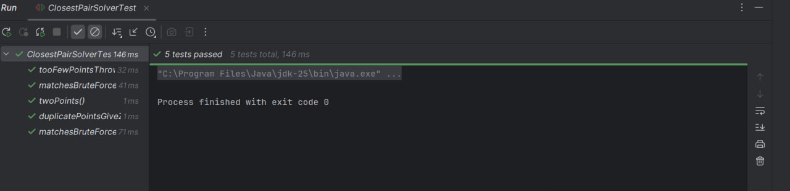

### Results file

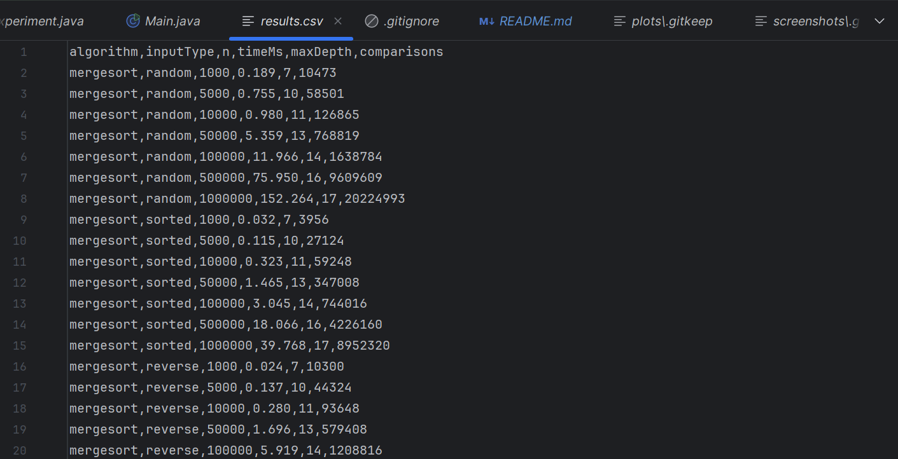

### Plots and tables

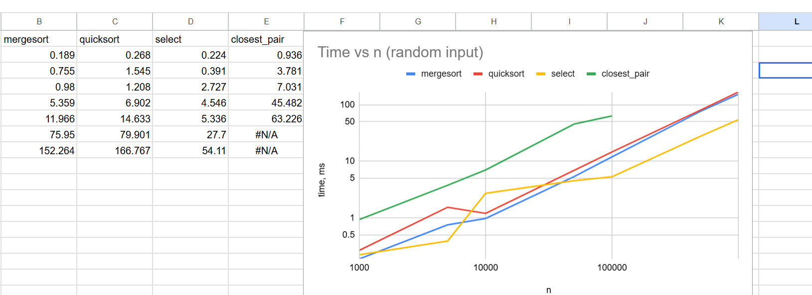

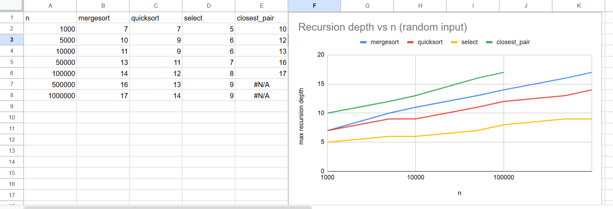

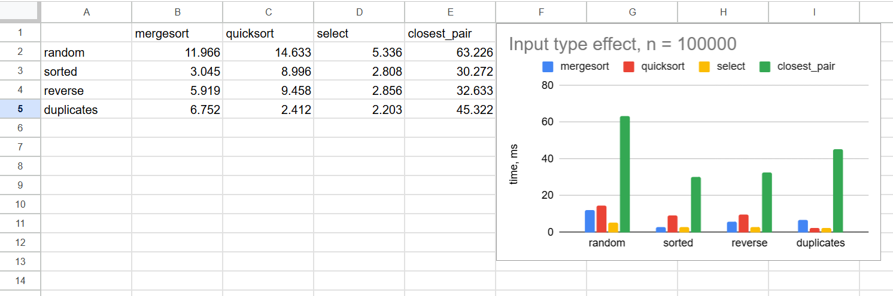